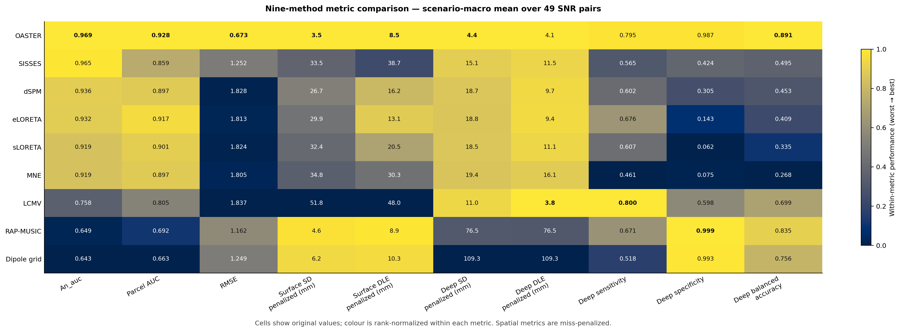
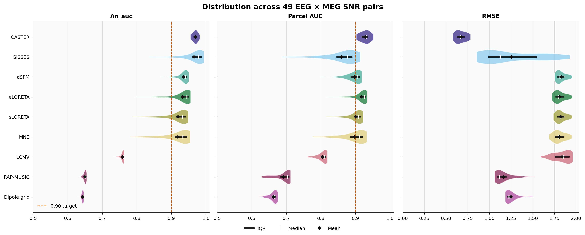
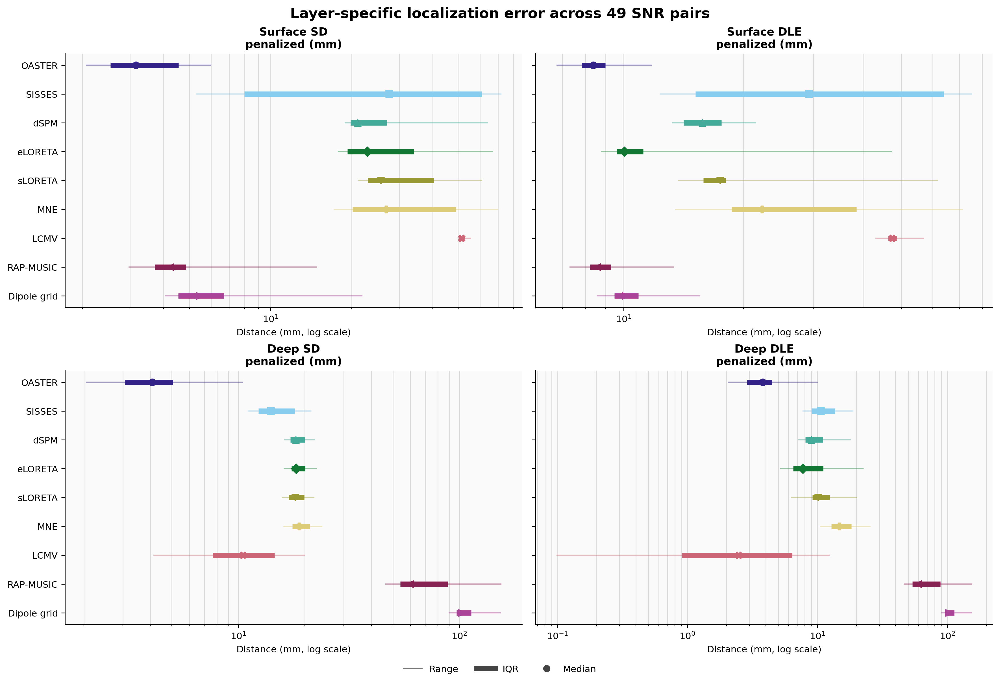
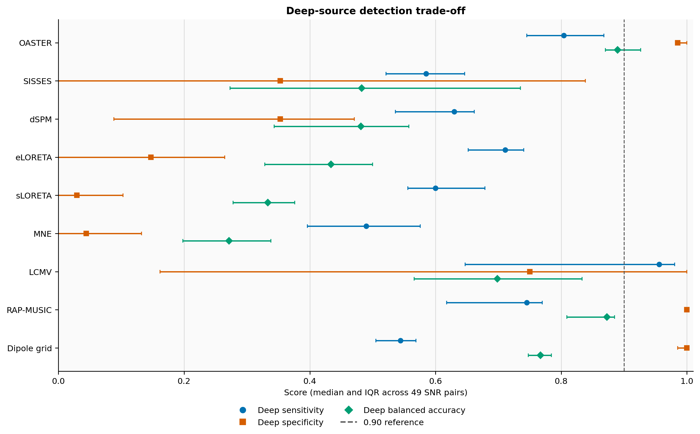
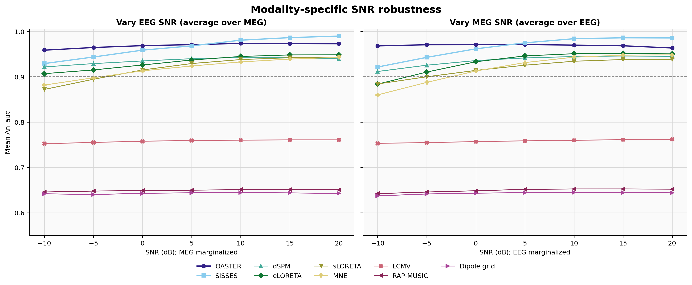
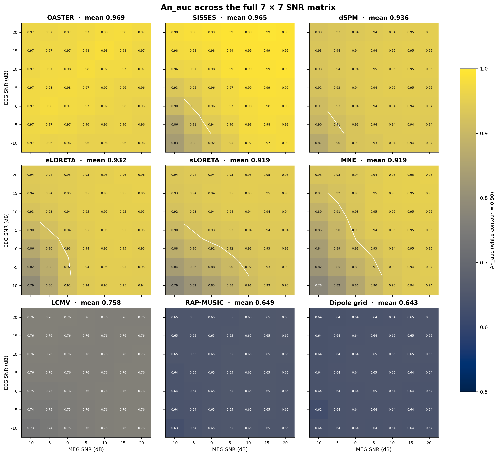
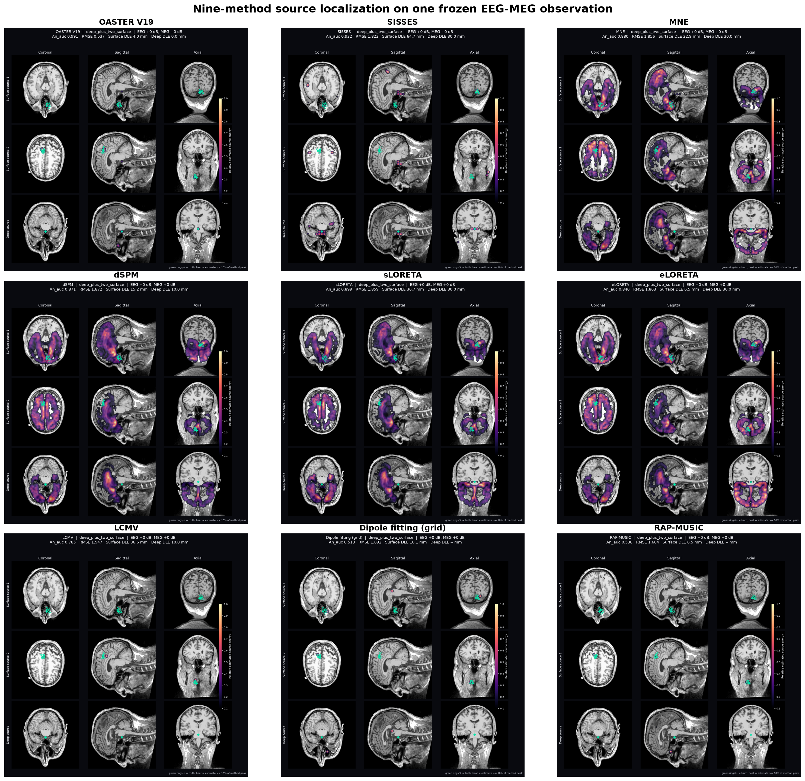
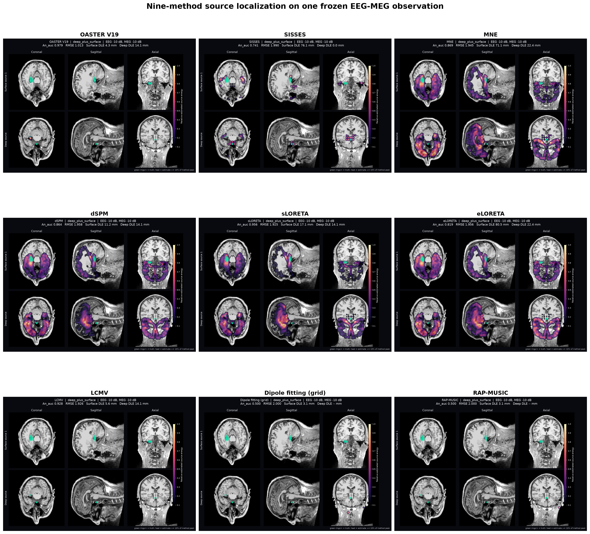

# 九方法可视化、统计与脑空间投影报告

本报告基于已完成并冻结的严格盲测：49 个 EEG×MEG SNR 组合、每个组合四类场景宏平均，共 9,065 个病例。比较方法为 OASTER V19、SISSES、MNE、dSPM、sLORETA、eLORETA、LCMV、网格偶极子拟合和 RAP-MUSIC。

## 主要结论

- OASTER 的 SNR 网格宏平均 `An_auc` 为 `0.968997 ± 0.007519`，最差 SNR 组合为 `0.955137`；49/49 个组合均达到 0.90。
- SISSES 的均值为 `0.965320 ± 0.035910`，最差为 `0.834602`。OASTER 的均值高 `0.003677`，但配对 bootstrap 95% CI 为 `[-0.005678, 0.014322]`、Holm 校正 `p=0.338`，不能声称显著优于 SISSES。
- 对其余七种方法，OASTER 的 `An_auc` 在 49/49 个 SNR 组合上均获胜；各配对 Wilcoxon 检验的 Holm 校正 `p=2.84e-14`。
- 九方法 `An_auc` 的 Friedman 总体检验为 `χ²(8)=365.921`，跨指标 Holm 校正 `p=2.89e-73`，Kendall's `W=0.933`，说明方法排序在测试网格内高度一致。
- 深层 penalized DLE 与深层 sensitivity 相对 LCMV 没有显著优势，因此这两项不作过度结论。

## 指标总览

下图在同一张图中呈现 10 项指标的九方法均值。单元格保留原始数值，颜色只在每个指标内部归一化；SD、DLE 使用漏检惩罚值。



完整数值表见：

- `outputs/01a0747c-f942-7dc2-b982-f01e067136c6/strict_benchmark_method_comparison.xlsx`：格式化总表、描述统计、OASTER 配对检验、总体检验和指标说明。
- `results/strict_blind/figures_v2/method_metric_statistics.csv`：九方法 × 十指标的均值、SD、中位数、IQR、极值与最差值。
- `results/strict_blind/statistics/`：bootstrap、Wilcoxon/Holm、Friedman、Kendall's W、秩二列效应量和逐 SNR 胜负明细。

## 多形式指标图

### AUC 与历史 RMSE 字段分布

小提琴宽度表示 49 个 SNR 组合的分布，粗线为 IQR，白线为中位数，菱形为均值。



### 表层与深层定位误差

森林图分别给出表层/深层 SD、DLE 的范围、IQR 与中位数；横轴采用对数尺度。



### 深层检测性能

同时比较 sensitivity、specificity 和 balanced accuracy，点为中位数，误差线为 IQR。



### EEG 与 MEG 信噪比鲁棒性

分别改变 EEG 或 MEG SNR，并对另一模态的七档 SNR 取平均。



### 九方法完整 SNR 热图

每个面板是 7×7 的 EEG×MEG SNR `An_auc`；白色等高线为 0.90。



## 脑空间源定位结果

绿色空心圆与加号是真值，magma 热图是估计源能量。每个方法按自身峰值归一化并仅显示不低于峰值 10% 的区域，所以这些图适合比较位置、扩散和伪源，不用于比较方法间绝对振幅。

### 主展示病例：0/0 dB，两个表层源 + 一个深层源



### 压力病例：−10/−10 dB，一个表层源 + 一个深层源



两个病例目录均包含九张方法独立图、总览图、统一评分 `metrics.csv` 和追溯元数据。SISSES 图读取保存的 `source_estimates`；其余方法从同一冻结 EEG/MEG 观测重算。读取前后 SISSES 文件大小、时间戳与 SHA-256 均未改变。

## 统计口径与边界

- 分析单位是 49 个预设 SNR 组合，不把 9,065 个病例误当成独立重复。
- 描述统计包括均值、SNR 间标准差、中位数、IQR、极值、最差值与 10,000 次配对非参数 bootstrap 95% CI。
- 总体比较使用 Friedman 检验和 Kendall's W，并对十个端点做 Holm 校正。
- OASTER 对八种基线的配对比较使用双侧 Wilcoxon signed-rank、指标内 Holm 校正、配对秩二列效应量及胜/平/负计数。
- 49 个 SNR 组合是固定实验网格，不是人群随机样本；统计量只说明该网格内的一致性，不能外推为临床或人群效应。
- `rmse` 是项目保留的历史字段名，实际定义为平方相对 Frobenius 误差。

## 复现命令

```powershell
python plot_strict_metrics.py
python analyze_strict_statistics.py
python plot_strict_brain_maps.py --case-number 3124
python plot_strict_brain_maps.py --case-number 92
```
