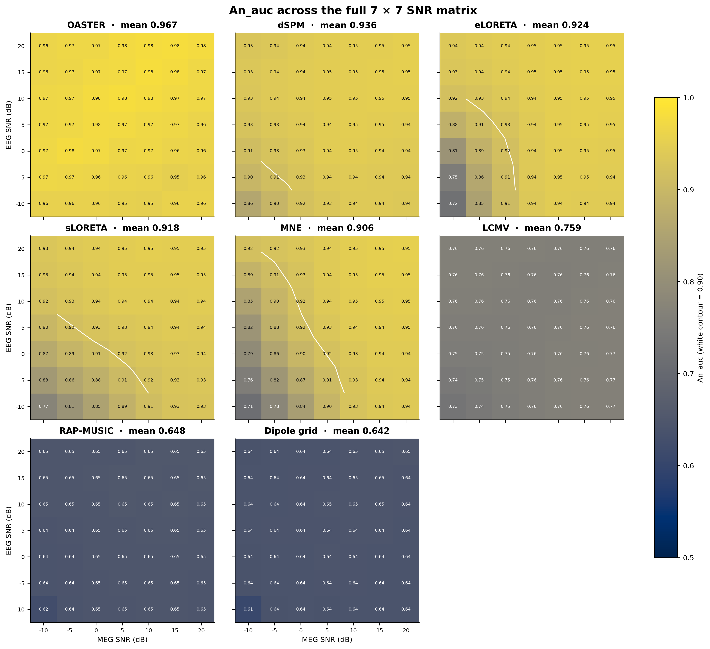
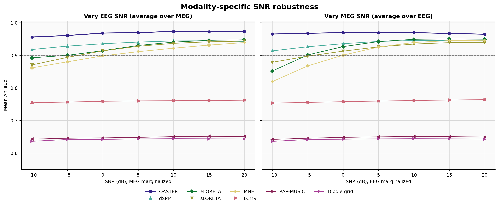
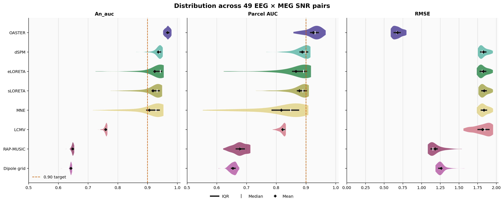
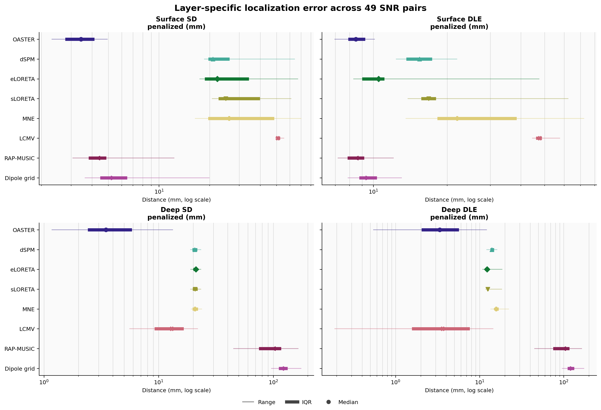
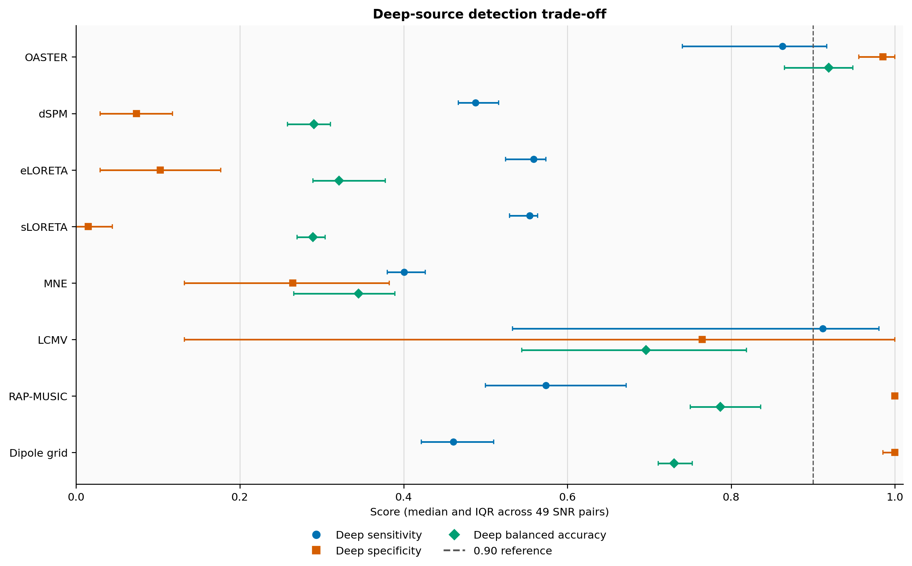
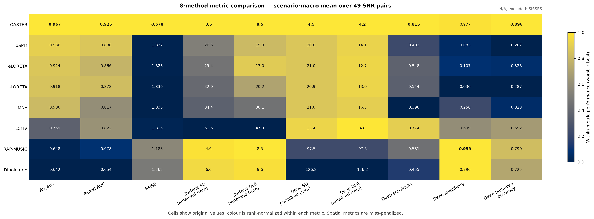
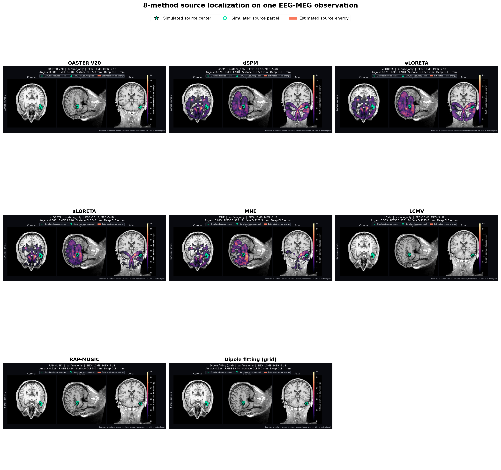
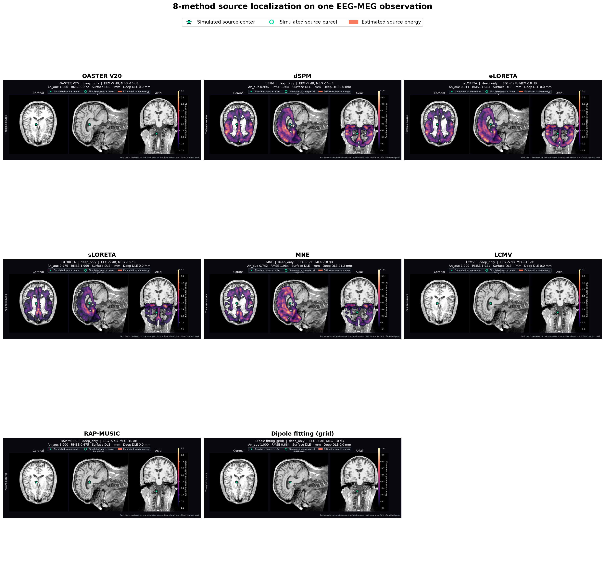
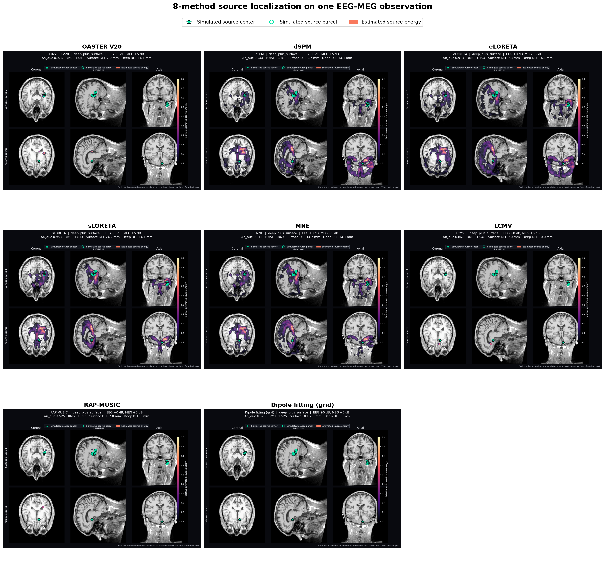
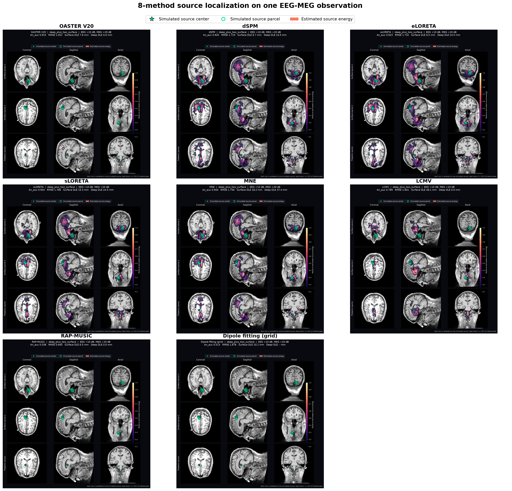

# corrected-v2 严格盲测最终报告

## 结论

OASTER V20 在修正后的双侧丘脑几何上完成全部 `9,114/9,114` 个严格盲测病例，错误数为 0。七种 Python 对比方法完成 `63,798/63,798 = 9,114 × 7` 行，错误数同样为 0。

主指标采用每个 EEG×MEG SNR 区组内四种场景等权宏平均的 `An_auc`。OASTER V20 的 49 区组均值为 **0.967424**，最低区组仍为 **0.951656**；相对每一种对比方法均在 **49/49** 个 SNR 区组胜出。其 raw / 原始 AUC 为 **0.924775**，RMSE 历史字段为 **0.677792**，深部 balanced accuracy 为 **0.896459**。

这些结果支持“整体跨 SNR 稳健且优于现有七种 Python 基线”，但不支持“每个细分场景×SNR 均超过 0.90”：复杂 `deep_plus_two_surface` 的最差细分单元为 **0.880359**。

## 1. 完整性与实验口径

| 项目 | 最终状态 |
|---|---|
| corrected-v2 manifest | `8147726ec34b548fba6f25fe6c05dd55933e4cf458c7c2cec94c31a9d7c5e60c` |
| 输入归档 | 456 个不可变 MAT chunk，9,114 个病例 |
| OASTER V20 | 9,114/9,114，0 errors，1 method |
| Python 对比方法 | 63,798/63,798，0 errors，7 methods |
| SNR 设计 | EEG 与 MEG 独立取 -10、-5、0、5、10、15、20 dB，共 49 个有序组合 |
| 场景 | `surface_only`、`deep_only`、`deep_plus_surface`、`deep_plus_two_surface` |
| 主聚合 | 每个 SNR 区组先对四场景等权宏平均，再在 49 个区组间描述/配对比较 |
| SISSES | N/A；未进入排名、Friedman 或 Wilcoxon 检验 |

完成标记分别见 [`oaster_v20_final/completion.json`](oaster_v20_final/completion.json) 和 [`comparators_final/completion.json`](comparators_final/completion.json)。OASTER V20 的算法 SHA-256 为 `d5a9f623377d0317b5d6bf1798d445c655d7cd36f4a26120a98f83c7090b09c4`，严格运行期间阈值固定为 0.1，未在盲测集重新校准。

## 2. OASTER V20 主要指标

| 指标 | 49 SNR 区组均值 | 区组间 SD | 最小值 | 最大值 | bootstrap 95% CI |
|---|---:|---:|---:|---:|---:|
| An_auc | 0.967424 | 0.008031 | 0.951656 | 0.981030 | [0.965185, 0.969624] |
| raw / 原始 AUC | 0.924775 | 0.026467 | 0.857024 | 0.966780 | [0.917231, 0.931905] |
| RMSE 历史字段 | 0.677792 | 0.062408 | 0.585199 | 0.800316 | [0.660910, 0.695131] |
| 深部 balanced accuracy | 0.896459 | — | 0.688725 | 0.982843 | — |

`rmse` 沿用历史字段名，实际定义是平方相对 Frobenius 误差，并非通常意义的均方根误差。

四类场景均完整运行 49 个 EEG×MEG SNR 组合；按单独场景汇总如下：

| 场景 | 每个 SNR 单元病例数 | 总病例数 | An_auc 均值 | An_auc 最小值 |
|---|---:|---:|---:|---:|
| `surface_only` | 68 | 3,332 | 0.978867 | 0.964350 |
| `deep_only` | 16 | 784 | 1.000000 | 1.000000 |
| `deep_plus_surface` | 68 | 3,332 | 0.970466 | 0.941986 |
| `deep_plus_two_surface` | 34 | 1,666 | 0.920364 | 0.880359 |

## 3. 各方法指标对比

下表均为 49 个 SNR 区组的四场景宏平均之均值。AUC 与 balanced accuracy 越高越好；误差、SD、DLE 越低越好。SD/DLE 使用漏检惩罚后的口径，单位为 mm。

| 方法 | An_auc ↑ | raw AUC ↑ | RMSE 字段 ↓ | 表层 SD ↓ | 表层 DLE ↓ | 深层 SD ↓ | 深层 DLE ↓ | 深层 BA ↑ |
|---|---:|---:|---:|---:|---:|---:|---:|---:|
| **OASTER V20** | **0.967424** | **0.924775** | **0.677792** | **3.530** | **8.499** | **4.540** | **4.213** | **0.8965** |
| dSPM | 0.936026 | 0.887800 | 1.826691 | 26.476 | 15.890 | 20.797 | 14.097 | 0.2873 |
| eLORETA | 0.924201 | 0.866339 | 1.823268 | 29.433 | 12.972 | 21.037 | 12.708 | 0.3279 |
| sLORETA | 0.918030 | 0.878080 | 1.836135 | 32.013 | 20.184 | 20.867 | 12.980 | 0.2870 |
| MNE | 0.906017 | 0.816912 | 1.833032 | 34.374 | 30.092 | 21.047 | 16.319 | 0.3227 |
| LCMV | 0.759082 | 0.821519 | 1.814603 | 51.473 | 47.913 | 13.398 | 4.753 | 0.6916 |
| RAP-MUSIC | 0.647997 | 0.678227 | 1.183193 | 4.597 | 8.534 | 97.490 | 97.490 | 0.7901 |
| Dipole fitting (grid) | 0.642017 | 0.654177 | 1.261704 | 6.049 | 9.618 | 126.158 | 126.158 | 0.7255 |

在这些预先指定的宏平均指标上，OASTER V20 同时取得最高的两种 AUC、最高深部 BA、最低相对平方误差，以及最低的表层/深层惩罚 SD 和 DLE。

机器可读的一行一方法宽表见 [`figures_v20/method_comparison_table.csv`](figures_v20/method_comparison_table.csv)。

## 4. An_auc 配对比较

统计区组是 49 个预设 EEG×MEG SNR 组合。差值均按 `OASTER - comparator` 计算。

| 对比方法 | 方法均值 | OASTER 优势 | 配对 bootstrap 95% CI | 胜/平/负 | Holm p |
|---|---:|---:|---:|---:|---:|
| dSPM | 0.936026 | +0.031398 | [+0.027519, +0.035849] | 49/0/0 | 2.49e-14 |
| eLORETA | 0.924201 | +0.043223 | [+0.030991, +0.057592] | 49/0/0 | 2.49e-14 |
| sLORETA | 0.918030 | +0.049394 | [+0.040271, +0.059750] | 49/0/0 | 2.49e-14 |
| MNE | 0.906017 | +0.061408 | [+0.047200, +0.077288] | 49/0/0 | 2.49e-14 |
| LCMV | 0.759082 | +0.208342 | [+0.205573, +0.211104] | 49/0/0 | 2.49e-14 |
| RAP-MUSIC | 0.647997 | +0.319428 | [+0.317487, +0.321350] | 49/0/0 | 2.49e-14 |
| Dipole fitting (grid) | 0.642017 | +0.325408 | [+0.323410, +0.327484] | 49/0/0 | 2.49e-14 |

An_auc 的八方法 Friedman 检验为 `χ²(7) = 318.007`，跨指标 Holm 校正后 `p = 6.88e-64`，Kendall's `W = 0.927`。49 个 SNR 区组是实验条件而非独立受试者，因此这些检验刻画的是本仿真网格内的稳定排序，不能直接外推成人群推断。

## 5. 低于 0.90 的细分单元

49 个四场景宏平均区组全部高于 0.95；但在 `4 × 49 = 196` 个单独场景×SNR 单元中，有 4 个 An_auc 低于 0.90，且全部属于一个深部点加两个皮层 patch 的复杂场景：

| EEG SNR (dB) | MEG SNR (dB) | 场景 | An_auc |
|---:|---:|---|---:|
| -5 | 15 | `deep_plus_two_surface` | 0.880359 |
| -10 | 10 | `deep_plus_two_surface` | 0.882397 |
| -10 | 5 | `deep_plus_two_surface` | 0.894849 |
| -5 | 20 | `deep_plus_two_surface` | 0.896289 |

这说明剩余困难主要集中在 EEG 很差、MEG 较好且源构型更复杂的模态失衡条件。后续若继续优化，应把这四个单元作为预先声明的外部确认目标，而不能回头用本轮严格盲测结果调参后仍称其为同一次盲测。

## 6. 指标图

以下图全部读取 OASTER V20 与七种完整 Python 基线；SISSES 显示为 N/A，不参与数值比较。

图表数据与完整统计输出分别位于 [`figures_v20`](figures_v20) 和 [`statistics_v20`](statistics_v20)；详细统计表见 [`statistics_v20/REPORT.md`](statistics_v20/REPORT.md)。

## 7. 修正几何的脑空间图与仿真真值

脑空间图位于 [`brain_maps_v20`](brain_maps_v20)，只使用 corrected-v2 的 `7,498` 个皮层点与经 `aseg` 标签 10/49 验证的 16 个双侧丘脑点。每个 montage 同时展示 OASTER V20 与七种 Python 对比方法：

- 绿色轮廓：仿真源 patch 的真实范围；
- 绿色星号：每个仿真源的精确中心；
- 彩色估计：各方法的定位结果，按方法自身峰值归一化并以 0.1 阈值显示。

四种协议场景的代表图：

| 场景 | EEG/MEG SNR | 病例 | 全方法 MRI montage |
|---|---:|---:|---|
| `surface_only` | -10 / -5 dB | 186 | [case_00186](brain_maps_v20/case_00186/all_methods_brain_mri.png) |
| `deep_only` | -5 / -10 dB | 1385 | [case_01385](brain_maps_v20/case_01385/all_methods_brain_mri.png) |
| `deep_plus_surface` | 0 / 5 dB | 3264 | [case_03264](brain_maps_v20/case_03264/all_methods_brain_mri.png) |
| `deep_plus_two_surface` | 10 / 20 dB | 6489 | [case_06489](brain_maps_v20/case_06489/all_methods_brain_mri.png) |

这些路径不得替换为 `results/strict_blind/brain_maps_v2`；旧目录使用的是错误的 legacy 深部几何。

## 8. SISSES 与解释边界

corrected-v2 的 SISSES 状态为 **N/A**。当前机器没有恢复出完整可执行的 SISSES 核心与适配流程，作者公开代码包也没有清晰可见的许可证，因此没有复制第三方源码或伪造 corrected-v2 结果。旧 SISSES 输出基于错误的 15 点 legacy 几何，与本报告不可比，也未进入排名或显著性检验。

本报告仍有以下边界：

- 仿真基于单个 MNE sample 解剖与固定 forward，不等同于跨受试者验证；
- 皮层按 68 个 `aparc` 分区覆盖，但没有逐个穷举全部 7,498 个顶点；深部只覆盖 16 个丘脑网格点；
- 混合场景轮换丘脑点，并非所有皮层中心与丘脑点的笛卡尔积；
- 49 个 SNR 区组宏平均稳定，不代表每个复杂细分单元都达到 0.90；
- SISSES 缺失，因此“优于所有方法”的结论仅限本轮八个完整方法。
