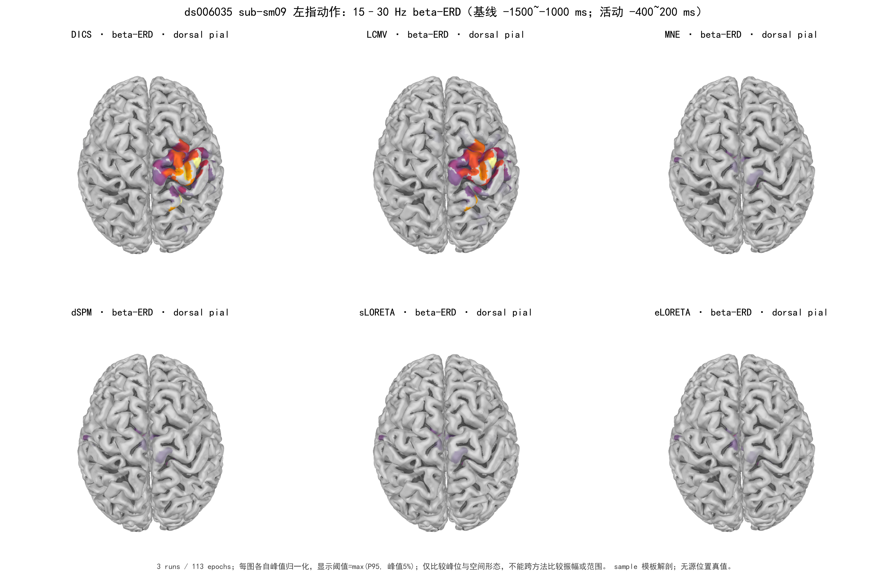

# ds006035 Finger：六方法 beta-ERD 对照（探索性）

数据仅有 `sub-sm09` 一名受试者的 3 个 run。严格匹配右腕刺激 event 32 与左指抬起 event 16 后有 118 对事件，质量控制后进入 response-lock 频域定位的共 113 个 epoch。六方法使用相同的 epoch、EEG+MEG 通道、逐 run forward、sample 模板皮层网格，以及相同的基线（−1500～−1000 ms）与活动窗（−400～200 ms）。DICS 用 15、17、…、29 Hz Morlet CSD；LCMV 和最小范数家族用 15–30 Hz 带通协方差。每个方法在两个条件间固定同一个滤波器或逆算子，三个 run 的 dB 源图按试次数聚合。

| 方法 | 右 precentral 富集 | 正向 ERD 质量在该 ROI 内 | 峰到 ROI 边界 |
|---|---:|---:|---:|
| DICS | 17.49 | 54.71% | 14.79 mm |
| LCMV | 15.17 | 47.45% | 0 mm（峰在 ROI 内） |
| MNE | 4.41 | 13.81% | 50.64 mm |
| dSPM | 4.41 | 13.81% | 50.64 mm |
| sLORETA | 4.41 | 13.81% | 50.64 mm |
| eLORETA | 2.96 | 9.27% | 50.64 mm |

富集定义为“ROI 内正向 ERD 平方质量占比 ÷ ROI 顶点占比”；1 是均匀网格零假设。距离 0 只表示峰落在 ROI 内，**不是零定位误差**。逐 run 的 DICS 右 precentral 富集依次为 1.76、15.88、7.59；LCMV 为 2.47、13.96、7.88，run 1 明显较弱。pooled 富集是重新评价聚合后的源图，不是这三个数的平均。

MNE、dSPM、sLORETA 的 ERD 源图在数值精度内相同：相对于 MNE 的 pooled 最大绝对差分别为 `1.23e−11`、`1.38e−11` dB。这是固定逆算子下每个源点的标准化因子在基线/活动功率比中抵消，不是三次独立支持。eLORETA 使用不同逆核。Dipole fitting、RAP-MUSIC 的现有实现是时间域诱发波形拟合；旧频谱 OASTER 只保留 active-over-baseline 功率增加，不能直接作为 beta-ERD 减少的结果，故不填造数值。

脑图只显示正向 ERD；每图各自峰值归一化，统一显示阈值为 `max(全顶点 P95, 各自峰值的 5%)`。这批图的正向 ERD 顶点不足 5%，所以全顶点 P95 为 0，实际由 5% 峰值下限决定。脑图仅定性比较峰位和空间形态，**不能跨方法比较原始幅值或激活范围**。[完整指标表](beta_multimethod_comparison.csv)、[逐源图数据](beta_multimethod_source_maps.npz)、[ROI 指标图](beta_multimethod_roi_comparison.png)以及[可复现脑图脚本](../../../../作者风格版/11-左指运动beta六方法脑图.py)保留在旁边。

限制：这是单名开发受试者、3 个相关 run，不能把 run 当独立受试者做显著性结论。宽运动窗与右腕刺激相关信号重叠；此前按试次反应时分析，刺激锁定 180～240 ms 与 response-MF 重叠约 78.8%，因此不能把全部 beta-ERD 都归因于左指自主运动。配准和 pial 图使用 MNE `sample` 模板，而非个体 MRI；没有已知真实源位置，不计算 AUC/DLE，也不能由 ROI 指标推断毫米级精度或临床可用性。
