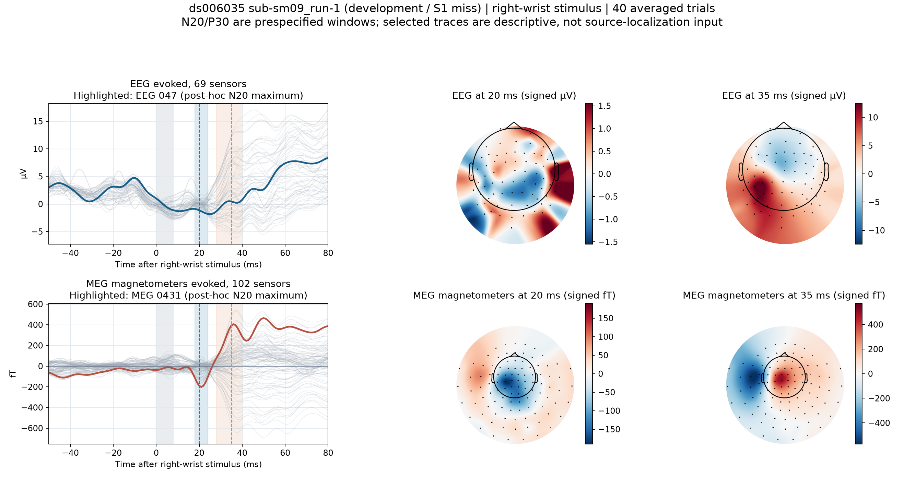
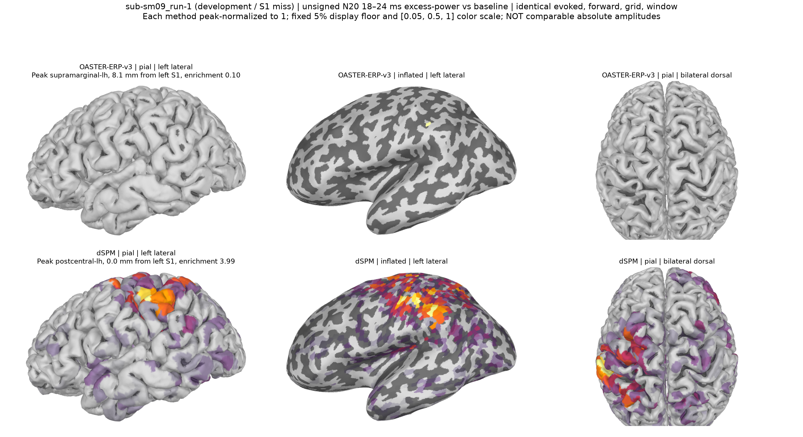
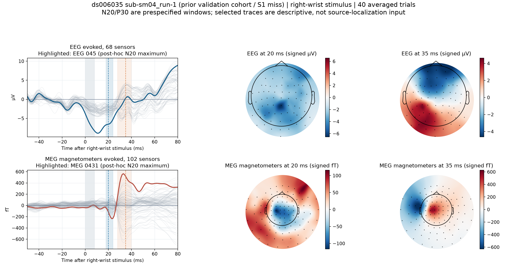
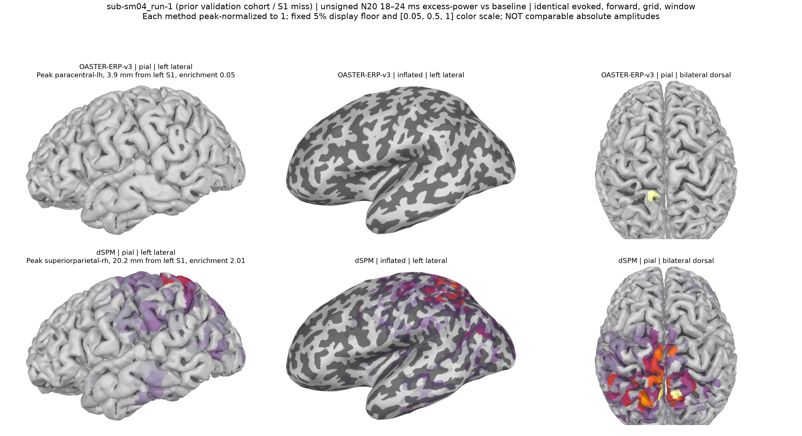
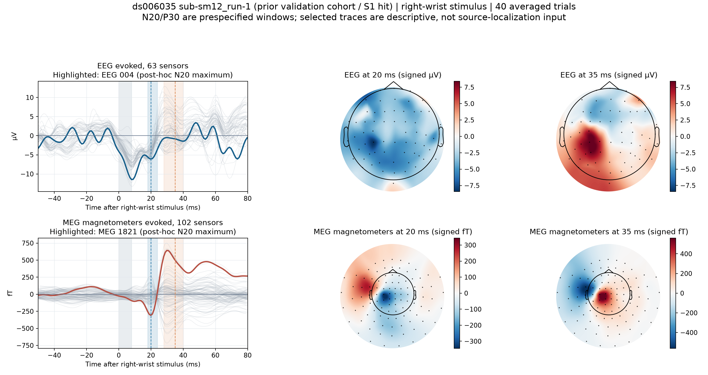
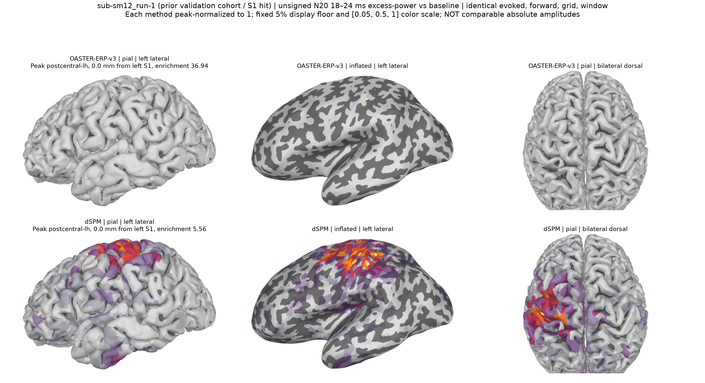

# ds006035 N20 可见性核查

三个 run 使用原八方法实验的同一已保存源图；波形来自相同预处理的单试次叠加平均。
N20 源图是 18–24 ms 相对基线的无符号超额功率幅度 sqrt(max(mean(active²)−mean(baseline²),0))，不是 20 ms 的有符号源电流波形。头皮拓扑分别是 20 与 35 ms。两法源图各自峰值归一化，
统一 5% 显示下限及相同归一化色标；不能据此比较绝对源电流。

## sub-sm09_run-1 (development / S1 miss)

事件 40，保留并平均 40 试次。
EEG 描述性通道 EEG 047，N20 平均 -1.410 µV；MAG 描述性通道 MEG 0431，N20 平均 -168.19 fT。

- OASTER-ERP-v3：峰 supramarginal-lh；距左 S1 最近点 8.1 mm；左 S1 富集 0.10。
- dSPM：峰 postcentral-lh；距左 S1 最近点 0.0 mm；左 S1 富集 3.99。

## sub-sm04_run-1 (prior validation cohort / S1 miss)

事件 40，保留并平均 40 试次。
EEG 描述性通道 EEG 045，N20 平均 -6.158 µV；MAG 描述性通道 MEG 0431，N20 平均 -169.67 fT。

- OASTER-ERP-v3：峰 paracentral-lh；距左 S1 最近点 3.9 mm；左 S1 富集 0.05。
- dSPM：峰 superiorparietal-rh；距左 S1 最近点 20.2 mm；左 S1 富集 2.01。

## sub-sm12_run-1 (prior validation cohort / S1 hit)

事件 40，保留并平均 40 试次。
EEG 描述性通道 EEG 004，N20 平均 -5.296 µV；MAG 描述性通道 MEG 1821，N20 平均 -204.14 fT。

- OASTER-ERP-v3：峰 postcentral-lh；距左 S1 最近点 0.0 mm；左 S1 富集 36.94。
- dSPM：峰 postcentral-lh；距左 S1 最近点 0.0 mm；左 S1 富集 5.56。

传感器高亮通道是看过本 run 的 18–24 ms 后选出的描述性通道；灰线是同类全部通道，
不可把高亮峰值当独立显著性或作为逆解输入。刺激伪迹 −2 至 +8 ms 已插值。

sm09 的 OASTER 峰是单点稀疏的缘上回峰：pial 外侧及俯视角未显示，inflated 外侧图仅见一个很小的亮点；
它并未落入左 S1。sm04 的 dSPM 全局峰在右侧上顶叶，不能把 dSPM 作为真值。

真实数据无已知源真值；模板皮层不是个体 MRI；显示出来的 N20 波形和脑图只能证明
信号成分可见，不能证明定位准确或 OASTER 优于 dSPM。
